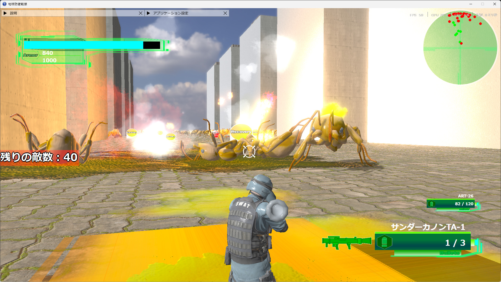
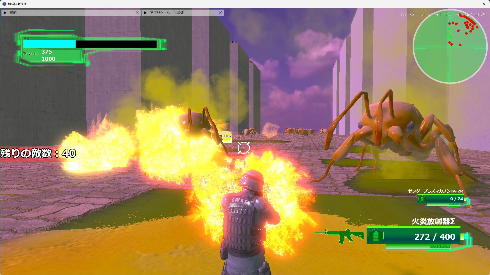
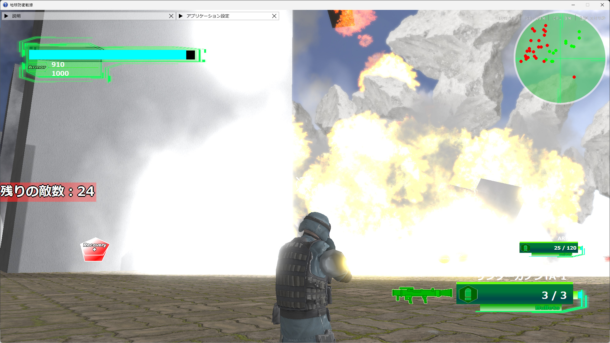
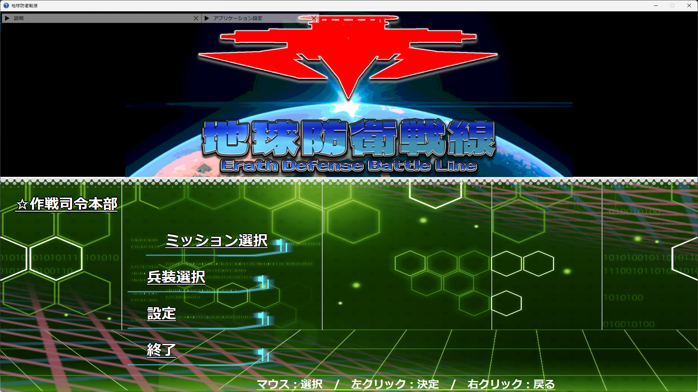
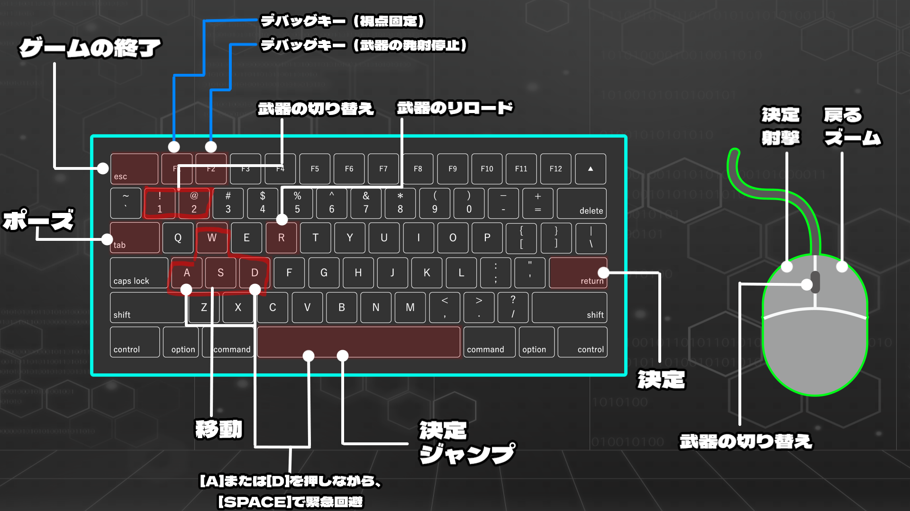

# [DX11_GraphicFramework]
## 1. 概要
私が好きなゲームを参考に制作した3Dアクションシューティングゲームです。
大量に押し寄せる敵をなぎ倒す爽快感と、DirectX11を用いた独自の描画エンジンが特徴です。

## 2. 実行画面

 
## 3. 技術スタック
- **言語**: C++
- **グラフィックスAPI**: DirectX11
- **シェーダ**: HLSL (Shader Model 5.0)
- **設計思想**: コンポーネント指向
- **外部ライブラリ**: 
  - Assimp (3Dモデル読み込み)
  - DirectXTex (テクスチャ読み込み)
  - Effekseer (エフェクト関連)
  - Imgui (デバッグ用エディタ)

## 4. こだわったポイント
### コンポーネント指向による柔軟な設計
各機能を「移動」「描画」「衝突判定」などのコンポーネントとして実装しました。これにより、新しいオブジェクトを生成する際に機能の分離がしやすく、拡張性の高いコードを実現しました。

### メモリ管理
- **スマートポインタ:** 所有権や循環参照などに気を付けながら、メモリリークを防止
- **リソース共有:** 同一データの重複ロードを回避（モデルやテクスチャなど）
- **オブジェクトプール:** 頻繁な動的確保（new/delete）を抑止し、処理落ちを防止

### 外部ファイルでパラメータ管理
武器やマテリアルなどのパラメータをcsvやjsonで管理しています。今後はステージやオブジェクトの情報なども外部ファイルから指定できるようにしようと考えています。

### HLSL 5.0 を用いた描画パイプライン
シェーダを活用し、[影の描画 / ポストエフェクト / ライティング] などを自前で実装しました。

## 5. ビルド・実行方法
企業の方の環境でスムーズに動作するよう、外部ライブラリを同梱しています。

1. 本リポジトリを `Clone` または `Download ZIP` します。
2. `DX11_3DGame.sln` を Visual Studio 2022 で開きます。
3. 構成を **`Debug`** または **`Release`**、プラットフォームを **`x64`** に設定します。
4. **`F5`** キーでビルドおよび実行が可能です。
   - ※ `packages` フォルダに必要なライブラリ（Assimp等）を含めているため、追加の環境構築は不要です。

## 6. 操作方法

